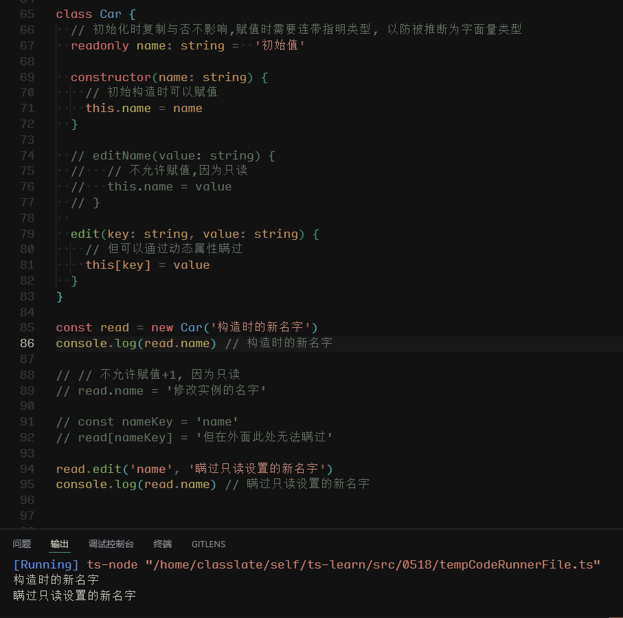

通过readonly 修饰的属性除了初始时赋值以及在constructor 中进行赋值外，在其它位置进行赋值是不允许的，
但像下面这样以动态属性动态传输属性名称的方式可以瞒过类型检查，对 readonly 修饰的属性进行赋值,

```ts
class Car {
  // 初始化时复制与否不影响,赋值时需要连带指明类型, 以防被推断为字面量类型
  readonly name: string = '初始值'

  constructor(name: string) {
    // 初始构造时可以赋值
    this.name = name
  }

  // editName(value: string) {
  //   // 不允许赋值,因为只读
  //   this.name = value
  // }

  edit(key: string, value: string) {
    // 但可以通过动态属性瞒过
    this[key] = value
  }
}

const read = new Car('构造时的新名字')
console.log(read.name) // 构造时的新名字

// // 不允许赋值+1, 因为只读
// read.name = '修改实例的名字'

// const nameKey = 'name'
// read[nameKey] = '但在外面此处无法瞒过'

read.edit('name', '瞒过只读设置的新名字')
console.log(read.name) // 瞒过只读设置的新名字
```

